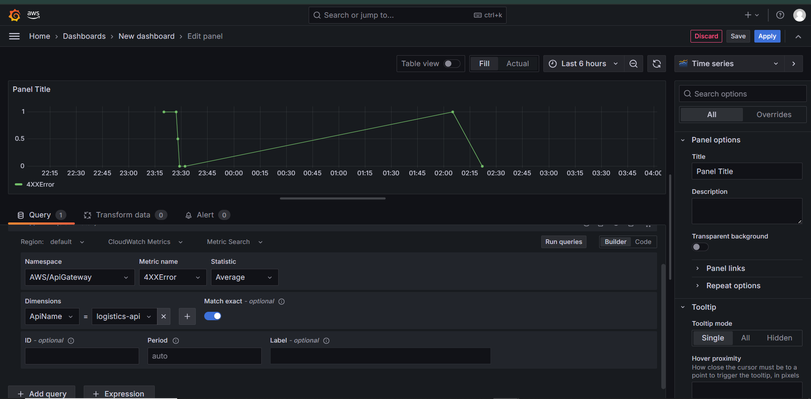

# 🚚 Logistics-Tracking Platform – *AWS Serverless, IaC, CI/CD, Observability*


> **A real-world logistics tracking API, fully automated with Terraform, monitored with Grafana, and CI/CD-ed via GitHub Actions. Built to scale, tested to break, and designed for learning and real production needs.**


---


##  Why I Built This & Why It Matters

When I started this project, my goal was simple: **build something that works like a real-world logistics system, not just another demo.** I wanted to prove (to myself and to future teams) that I could take a business problem—tracking parcels end-to-end—and solve it with the exact tools companies use every day.

### What makes this useful in real life?

* **It's not just code—it's infrastructure you can trust.**
  With Terraform, every AWS resource is defined, versioned, and reproducible. No guesswork, no surprises. Anyone on the team can deploy or tear it down, and the whole process is automated from GitHub Actions.

* **It's the way modern teams ship features.**
  Serverless (Lambda, API Gateway, DynamoDB) means you can launch quickly and scale instantly, without worrying about servers. This is how startups move fast—and how big companies save money.

* **You get visibility, not just "it works."**
  I didn’t stop at “it runs.” I added Grafana dashboards, load testing, and real monitoring so you can see how everything behaves under real load—and spot problems before users do.

* **Mistakes are documented, not hidden.**
  This isn’t a “perfect” showcase. I hit errors, found weird Terraform gotchas, and solved real issues you’d face on the job. I left those in, because real DevOps is about troubleshooting and learning fast.

* **For recruiters and teams:**
  This repo is proof I can architect, automate, observe, and iterate on production-grade cloud systems. If you’re hiring someone who cares about both speed and stability—and documents the journey for the next person—I’d love to talk.

---

**TL;DR:**
I built this platform to reflect real business needs, using real AWS tools, with all the lessons and scars along the way. It’s meant for anyone who values reliable automation, clear monitoring, and DevOps done right.


---
## 📑 Table of Contents

- [Project Highlights](#project-highlights)
- [Architecture](#architecture)
- [Whats Inside](#whats-inside)
- [Screenshots & Walkthrough](#screenshots--walkthrough)
    - [API in Action](#1-api-in-action)
    - [AWS Lambda & DynamoDB](#2-aws-lambda--dynamodb)
    - [CI/CD & Automation](#3-cicd--automation)
    - [Monitoring & Observability](#4-monitoring--observability)
    - [CloudWatch Metrics](#5-cloudwatch-metrics)
- [Load Testing & Results](#load-testing--results)
- [Troubleshooting & Lessons Learned](#troubleshooting--lessons-learned)
- [How to Run This Project](#how-to-run-this-project)
- [Video Demo](#video-demo)
- [Connect With Me](#connect-with-me)
- [Keywords](#keywords)
- [Why This Project](#why-this-project)


---
##  Project Highlights

- **End-to-End AWS Automation**: Infrastructure as Code with Terraform—no manual setup.
- **Serverless & Cost-Effective**: AWS Lambda + API Gateway + DynamoDB.
- **Modern CI/CD**: GitHub Actions automates every deployment.
- **Monitoring & Observability**: CloudWatch + Amazon Managed Grafana dashboards.
- **Load Tested**: Pushed to 3,000 concurrent users—see the stats and learnings below!
- **Documented Real-World Errors**: I own my mistakes and show how I fixed them.
- **Visual Demo**: [Soundless video demo on YouTube](#) *(coming soon!)*

---

##  Architecture


*Architecture designed and drawn for clarity by Adedoyin Ekong*

---

##  What’s Inside

- **Terraform IaC**: Stand up Lambda, API Gateway, DynamoDB, IAM roles, and Grafana.
- **Lambda Function**: Handles `/track` POST and `/parcel/{id}` GET endpoints.
- **DynamoDB Table**: Stores parcel tracking data (Partition Key: `parcel_id`).
- **API Gateway**: Public API endpoints.
- **Monitoring**: CloudWatch for logs & metrics, visualized in Grafana.
- **CI/CD Pipeline**: Automated deploy/destroy with GitHub Actions.

---

##  Screenshots & Walkthrough

### 1. **API in Action**
- **POST /track** (track a parcel):  
  
- **GET /parcel/{id}** (retrieve tracking info):  
  
- **API Gateway Resources**  
  

### 2. **AWS Lambda & DynamoDB**
- **Lambda Triggered by API Gateway**:  
  
- **Lambda Function Overview**:  
  
- **DynamoDB Table**:  
  

### 3. **CI/CD & Automation**
- **Zipping Lambda code before deploy** *(required for Terraform to work!)*:  
  

### 4. **Monitoring & Observability**
- **Grafana Setup (Connected to CloudWatch)**:  
    
  
- **Grafana Workspace & Login**:  
    
    
  
- **API Gateway 4xx/5xx & Latency Dashboards**:  
    
    
  
- **DynamoDB Monitoring in Grafana**:  
    
  
- **Lambda Metrics in Grafana**:  
    
    
    
  

### 5. **CloudWatch Metrics**
- **Combined API & Lambda Metrics**:  
  

---

##  Load Testing & Results

- I simulated **3,000 concurrent users** hitting my API with Artillery.
- The API handled about **1,600 successful requests**, with an average response time of ~360ms.
- As expected for free-tier resources, some requests timed out or returned errors at high load, demonstrating the need for further tuning at higher scale.

**Sample Artillery Report:**  
  


---

##  Troubleshooting & Lessons Learned

### Common Error:  
> `open lambda/handler.zip: no such file or directory`

**Why?**  
Terraform requires the zipped Lambda code (`handler.zip`) to exist before both `apply` *and* `destroy`—otherwise, destroy fails with the above error.

**How I Owned & Fixed It:**  
- Always re-zip (`zip handler.zip handler.py`) before any `terraform apply` or `terraform destroy`.
- See [screenshot](images/handler.zip%20deflate.png) for process.
- Documented the error and fix for the next engineer (or my future self!).

---

##  How to Run This Project

1. **Clone the repo:**  
   `git clone https://github.com/yourname/logistics-tracking-platform.git`
2. **Create and zip Lambda code:**  
```

cd infra/lambda
zip handler.zip handler.py
cd ../..

```
3. **Terraform Init & Apply:**  
```

cd infra
terraform init
terraform apply -auto-approve

```
4. **API Endpoints:**  
- `POST /track` — add or update parcel status
- `GET /parcel/{id}` — fetch parcel status

5. **Monitor** in AWS CloudWatch or Grafana (see screenshots above).

6. **To destroy infra:**  
- Re-zip Lambda if needed, then  
- `terraform destroy -auto-approve`

> **Note:** If you get a *handler.zip not found* error on destroy, re-zip your Lambda code and try again!

---

##  Video Demo

*I’m uploading soundless video demos to my YouTube soon! Check back or [visit my channel](#) for the latest.*  
<!-- Add actual YouTube link when ready -->

---

##  Connect With Me

- [LinkedIn](https://www.linkedin.com/in/adedoyin-ekong/) 
- [GitHub](https://github.com/doyindevops)
- [Medium](https://medium.com/@adedoyinekong)

---

##  Keywords

`#Terraform #AWS #Serverless #DevOps #CI/CD #Lambda #DynamoDB #APIGateway #Grafana #CloudWatch #Monitoring #Automation #Artillery #LoadTesting`

---

##  Why This Project?

I built this to **practice by doing**—solving real DevOps problems, simulating real-world scale, and pushing AWS free tier to its limit. I own my errors, document my fixes, and share my journey for both DevOps engineers and curious recruiters.

---


